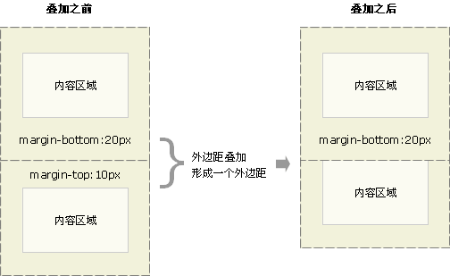
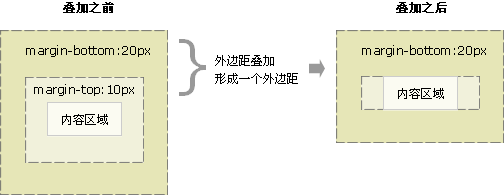

> Demo 示例:demo/html/cssIndex.html

### 1、属性选择器

- [attr]：指定属性的元素；
- [attr=val]：属性等于指定值的元素；
- [attr*=val]：属性包含指定值的元素；
- [attr^=val] ：属性以指定值开头的元素；
- [attr$=val]：属性以指定值结尾的元素；

```html
<ul>
  <li title="hello">1</li>
  <li title="age">2</li>
  <li title="age123">3</li>
  <li title="first12312">4</li>
  <li title="first12312end">5</li>
  <li data-name>6</li>
</ul>
```

```css
li[title="hello"] {
  color: #42b983;
}

li[data-name] {
  color: red;
}

li[title*="age"] {
  color: yellowgreen;
}

li[title^="first"] {
  color: yellow;
}

li[title$="end"] {
  color: orchid;
}
```

### 2、组合选择器

- 相邻兄弟选择器：A + B //如果需要选择紧接在另一个元素后的元素，而且二者有相同的父元素，可以使用相邻兄弟选择器
- 普通兄弟选择器：A ~ B //兄弟选择符，位置无须紧邻，只须同层级，A~B 选择 A 元素之后所有同层级 B 元素。
- 子选择器：A > B
- 后代选择器：A B

### 3、行为伪类

:active：鼠标激活的元素； //鼠标点击的时候变化
:hover： 鼠标悬浮的元素；

### 4、状态伪类

:target：当前锚点的元素；//注意是锚点
:link：未访问的链接元素； //浏览器运行后并未点击链接，而链接的字体颜色无效。语法正确的情况下，这是由于浏览器缓存的原因，尝试清除浏览器缓存，清除掉浏览的历史记录。
:visited：已访问的链接元素； //注意只要在浏览器中的历史记录中存在过，就会显示已访问过的状态
:focus：输入聚焦的表单元素；
:required：输入必填的表单元素；

### 5、结构伪类

:root：文档的根元素；
:empty：无子元素的元素；
:first-letter：元素的首字母；
:first-line：元素的首行；
:nth-child(n)：元素中指定顺序索引的元素；
:nth-last-child(n)：元素中指定逆序索引的元素；；
:first-child：元素中为首的元素；
:last-child ：元素中为尾的元素；
:only-child：父元素仅有该元素的元素；
:nth-of-type(n)：标签中指定顺序索引的标签；
:nth-last-of-type(n)：标签中指定逆序索引的标签；
:first-of-type ：标签中为首的标签；
:last-of-type：标签中为尾标签；
:only-of-type：父元素仅有该标签的标签；

### 样式优先级

优先级就是分配给指定的 CSS 声明的一个权重，它由匹配的选择器中的每一种选择器类型的数值决定。为了记忆，可以把权重分成如下几个等级，数值越大的权重越高：

10000：!important；
01000：内联样式；
00100：ID 选择器；
00010：类选择器、伪类选择器、属性选择器；（类名）
00001：元素选择器、伪元素选择器； （p、span）
00000：通配选择器、后代选择器、兄弟选择器；

### 4、格式化上下文 BFC

#### 4.1 BFC 是 Web 页面中盒模型布局的 CSS 渲染模式，指一个独立的渲染区域或者说是一个隔离的独立容器。

#### 4.2 形成 BFC 的条件

1、浮动元素，float 除 none 以外的值；
2、定位元素，position（absolute，fixed）；
3、display 为以下其中之一的值 inline-block，table-cell，table-caption；
4、overflow 除了 visible 以外的值（hidden，auto，scroll）；

#### 4.3 BFC 应用场景

**1、 自适应两栏布局**

应用原理：BFC 的区域不会和浮动区域重叠，所以就可以把侧边栏固定宽度且左浮动，而对右侧内容触发 BFC，使得它的宽度自适应该行剩余宽度。

```html
<div>
  <div class="left-area">左侧区域</div>
  <div class="right-area">右侧自适应区域</div>
</div>
```

```css
.left-area {
  float: left;
  width: 100px;
  background-color: red;
}

/*触发 BFC*/
.right-area {
  overflow: auto;
  background-color: yellow;
}
```

**2、清除内部浮动**

浮动造成的问题就是父元素高度坍塌，所以清除浮动需要解决的问题就是让父元素的高度恢复正常。而用 BFC 清除浮动的原理就是：计算 BFC 的高度时，浮动元素也参与计算。只要触发父元素的 BFC 即可。

```html
<div class="box15">
  <div class="float-area">float区域</div>
</div>
```

```css
.box15 {
  background-color: green;
  overflow: hidden; /*触发 BFC*/
}

.box15 .float-area {
  float: left;
  width: 100px;
  height: 200px;
  background-color: red;
}
```

通过 overflow: hidden 来清除浮动并不完美，当元素有阴影或存在下拉菜单的时候会被截断，所以该方法使用比较局限。

所以在父元素上使用以下属性：

```css
.clearfix::after {
  content: "";
  display: block;
  clear: both; /**这里**/
}
```

**3、防止垂直 margin 合并**

BFC 渲染原理之一：同一个 BFC 下的垂直 margin 会发生合并。所以如果让 2 个元素不在同一个 BFC 中即可阻止垂直 margin 合并。那如何让 2 个相邻的兄弟元素不在同一个 BFC 中呢？可以给其中一个元素外面包裹一层，然后触发其包裹层的 BFC，这样一来 2 个元素就不会在同一个 BFC 中了。

- 当一个元素包含在另一个元素之中时，子元素与父元素之间也会产生重叠现象，重叠后的外边距，等于其中最大者：
  

- 如果一个无内容的空元素，其自身上下边距也会产生重叠。
  

```html
<div class="layout">
  <div class="a">a</div>
  <div class="contain-b">
    <div class="b">b</div>
  </div>
</div>
```

```css
.demo3 .a,
.demo3 .b {
  border: 1px solid #999;
  margin: 10px;
}
.contain-b {
  overflow: hidden;
}
```

### 5、三角形画法

宽高为 0.设置 border 的样式

```css
.box18 {
  width: 0px;
  height: 0px;
  border-left: 30px solid red;
  border-top: 15px solid transparent;
  border-bottom: 15px solid transparent;
}
```

**增大点击区域**

常常在移动端的时候点击的按钮的区域特别小，但是由于现实效果又不太好把它做大，所以常用的一个手段就是通过透明的边框来增大按钮的点击区域：

```css
.btn {
  border: 5px solid transparent;
}
```

### 两列布局

### 相关链接

- [1.5 万字 css 基础拾遗（核心知识、常见需求）](https://mp.weixin.qq.com/s/S008EYuPxLqKFBnss5mZyw)
