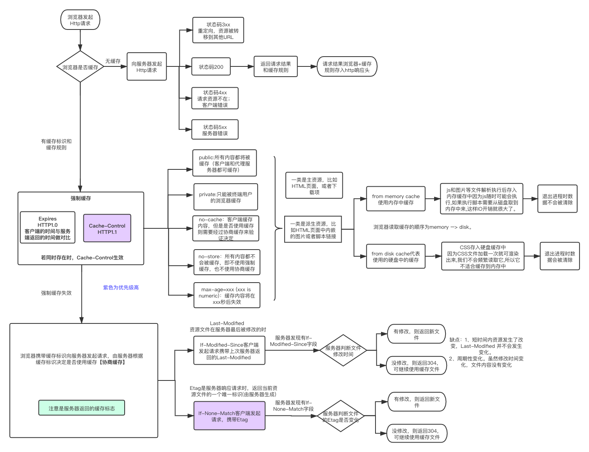
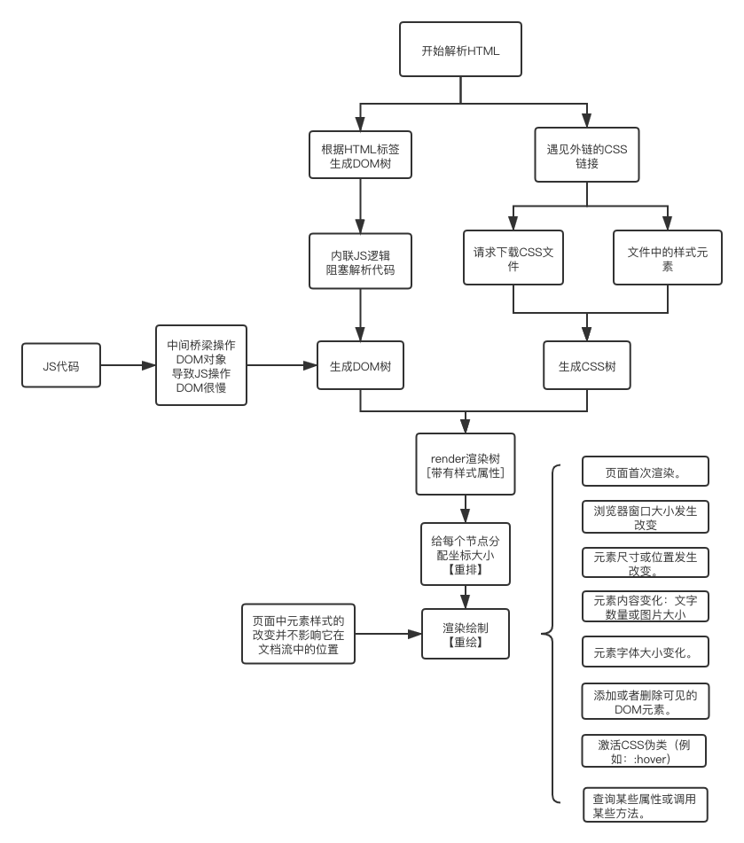
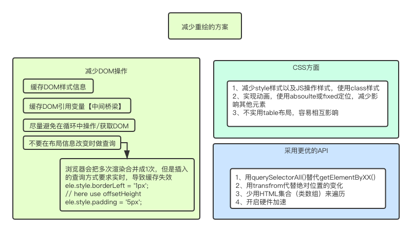

### 1、进行 URL 解析

- 1、网络标准定义 URL 只能使用字母和数字以及其他特殊符号，若不转义可能会出现歧义，如出现其他语言。
- 2、浏览器 URL 编码，用的是操作系统的默认编码。如 GB2312 编码(Firefox/IE)和 utf-8 编码(Firefox/chrome)
- 3、为了保证客户端只用一种编码方法向服务器发出请求，就是使用 Javascript 先对 URL 编码，然后再向服务器提交，不要给浏览器插手的机会。因为 Javascript 的输出总是一致的，所以就保证了服务器得到的数据是格式统一的。
- 4、两种对 URL 编码：
  - 4.1 encodeURI()：对整个 URL 进行编码，有特殊含义的符号`; / ? : @ & = + $ , #`，不进行编码(要保证整个 URL 的含义正确)，解码函数是 decodeURI()。
  - 4.2 encodeURIComponent()，用于对 URL 的组成部分进行个别编码，而不用于对整个 URL 进行编码。因此，`; / ? : @ & = + $ , #`会被编码，它对应的解码函数是 decodeURIComponent()。
  - 4.3 URI 包括 URL 和 URN 两个类别，URL 是 URI 的子集，所以 URL 一定是 URI，而 URI 不一定是 URL；
    - 4.3.1 URI：统一资源标志符，用来标识抽象或物理资源的一个紧凑字符串；
    - 4.3.2 URL：统一资源定位符，一种定位资源的主要访问机制的字符串

#### 各种编码的区别

- Unicode 英文编码，包含 ASCII 字母、数字、标点符号
- GB2312 是对 ASCII 的中文扩展。[GB 表示国标]
- GBK 对 GB2312 的扩展：一个汉字=两个英文字符
- UNICODE 编码 IOS 组织包括地球上所有字符，一个汉字=一个英文字符=两个字节
- UTF-8 网络上传输标准，UTF8 就是每次 8 个位传输数据，而 UTF16 就是每次 16 个位，
- UTF-8 是世界性通用代码，也完美的支持中文编码，如果我们做的网站能让国外用户正常的访问，就最好用 UTF-8。
- GB2312 属于中文编码，主要针对国内用户使用，如果国外用户访问 GB2312 编码的网站就会变乱码。

### 2、DNS 解析

- 浏览器输入 URL，先查浏览器缓存的域名否有对应 IP 记录
- 若无，再去查本地 host 文件对应 IP 地址
- 若无，则去找 DNS 服务器，包括路由缓存和互联网 DNS 服务器, 以及 13 台根服务器

前端的 DNS 优化，可以在 html 页面头部写入 DNS 缓存地址，比如

```html
<meta http-equiv="x-dns-prefetch-control" content="on" />
<link rel="dns-prefetch" href="http://www/xxx.com" />
```

### 3、http 协议的三次握手

- 1、第一次握手：主机 A 给服务器发送 TCP 包，包含确认码 seq；
- 2、第二次握手：主机 B 收到请求后，向主机 A 放确认码 seq+1；
- 3、第三次握手：主机 A 确认确认码正确后，向主机 B 发送确认码 seq+2，主机 B 接受后确认连接成功；

#### 为什么两次握手不行？

- 第二次握手，主机 B 无法确认主机 A 是否收到确认码，导致主机 B 一旦收到请求就发送数据，服务器很容易受到攻击。

### 4、浏览器缓存

#### 4.1 HTML Meta 标签控制缓存

虽然 mate 标签可以设置缓存策略：`<META HTTP-EQUIV="Pragma" CONTENT="no-cache">`，但是由于兼容性问题，该方法不实用；

#### 4.2 浏览器缓存

在浏览器本地缓存失效后,浏览器会向 CDN 边缘节点发起请求,遵循 http 标准协议:



### 5、解析 Html

- 1、从上到下解析 Html 标签生成 DOM 树；
- 2、遇见外链的 CSS 和内联 JS，会暂停解析，请求下载并执行脚本；
- 4、遇见 img 标签，下载请求对应的图片（该过程不会阻塞 HTML 解析）
- 5、根据生成的 DOM 树和 解析的 CSS 树，生成布局渲染树(render tree)
- 6、计算每一个元素的大小、位置等，给出每个节点所应该在屏幕上出现的精确坐标
- 7、绘制渲染树，根据布局渲染树进行绘制；



#### 5.1 重绘和重排的区别

- 重绘是指一个元素外观的改变所触发的浏览器行为，浏览器会根据元素的新属性重新绘制，使元素呈现新的外观。如颜色的改变；
- 重排（回流）当渲染树中的一部分(或全部)因为元素的规模尺寸，布局，隐藏等改变而需要重新构建, 这就称为回流；
- 『重绘』不一定会出现『重排』，『重排』必然会出现『重绘』

#### 5.2 如何避免重绘或者重排？



### 参考文章

- [阿里面试官的”说一下从 url 输入到返回请求的过程“问的难度就是不一样！](https://juejin.cn/post/6928677404332425223)
- [编码方式的比较，以及 UTF-8，gb2312 的选择](https://www.cnblogs.com/shanwater/p/5616589.html)
- [彻底理解浏览器的缓存机制](https://www.cnblogs.com/xiaozhumaopao/p/14724802.html)
- [浏览器的渲染/重绘原理](https://www.cnblogs.com/xiaozhumaopao/p/14724819.html)
- [实践这一次，彻底搞懂浏览器缓存机制](https://segmentfault.com/a/1190000017962411)
- [浏览器的工作原理：新式网络浏览器幕后揭秘](https://www.html5rocks.com/zh/tutorials/internals/howbrowserswork/)
- [如何减少 HTML 页面回流与重绘](https://zhuanlan.zhihu.com/p/22181897)
- [重排与重绘](https://www.imooc.com/article/269665)
