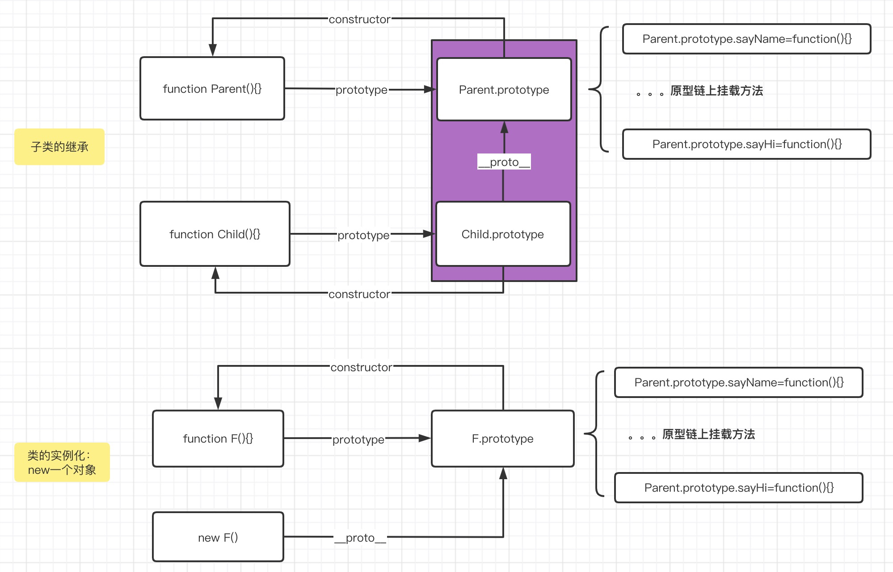

## 1、JS 构造函数

### 1.1 构造函数是一个普通的函数，首字母大写

- 1、函数体内部使用了 this 关键字，代表了所要生成的对象实例。
- 2、生成对象的时候，必须使用 new 命令。
- 3、构造函数也可以接受参数

```js
var Vehicle = function(name) {
  this.name = name;
};
var v = new Vehicle("小话");
```

### 1.2 构造函数分为 实例成员 和 静态成员

实例成员： 实例成员就是在构造函数内部，通过 this 添加的成员。实例成员只能通过实例化的对象来访问。
静态成员： 在构造函数本身上添加的成员，只能通过构造函数来访问

```js
function Star(name, age) {
  //实例成员
  this.name = name;
  this.age = age;
}
//静态成员
Star.sex = "女";

let stars = new Star("小红", 18);
console.log(stars); // Star {name: "小红", age: 18}
console.log(stars.sex); // undefined     实例无法访问sex属性

console.log(Star.name); //Star     通过构造函数无法直接访问实例成员
console.log(Star.sex); //女       通过构造函数可直接访问静态成员
```

## 2、Object.create 实现原理

var a = Object.create(b)方法创建一个新对象，使用现有的 b 对象来提供新创建的 a 对象的 `__proto__`。方便新建的对象 a 继承对象 b 的方法属性。

简单来说就是把 `a.__proto__ = b`

简单示例：

```js
var obj = {
  name: "xiaohua",
};
var child = Object.create(obj);
console.log(child.__proto__ === obj); //true
```

常用来解决类的继承：
Father.prototype 就是原型，它是一个对象，我们也称它为原型对象。原型的作用，就是共享方法。



类似 Star.prototype = {} 给原型重新赋值<b style="color:red">注意不是给原型上添加方法，是重写了原型</b>，此时会丢失构造器，我们需要手动定义构造器，指回构造函数本身

```js
//函数对象的 prototype 原型对象的构造函数指向其本身
function Child2() {
  this.name = "xiaohua2";
}
console.log(Child2.prototype.constructor); //Child2

//类似 Star.prototype = {} 给原型重新赋值，此时会丢失构造器，我们需要手动定义构造器，指回构造函数本身
function Parent() {
  this.name = "xiaohua";
}
Parent.prototype.sayName = function() {
  console.log(this.name + " say name");
};

function Child() {
  Parent.call(this);
}
Child.prototype = Object.create(Parent.prototype); //将子类的原型通过__proto__挂载到父类的原型上，则子类可以使用父类原型上的方法

let child1 = new Child();
child1.sayName(); //xiaohua say name
console.log(child1.name); //xiaohua
console.log(Child.prototype.constructor); //这里应该指向的是Child构造函数，但是却指向了Parent构造函数，所以要做重新指向

Child.prototype.constructor = Child;
console.log(Child.prototype.constructor);
```

**Object.create 方法的原理**

```js
Object.create = function(obj) {
  function F() {}
  F.prototype = obj;
  return new F(); //new命令实际上也是创建并返回 return result = new F() === Object.create(F.prototype) === Object.create(obj)
};
```

## 3、new 命令的原理

使用 new 命令时，它后面的函数依次执行下面的步骤。

- 1、转换入参为数组，提取构造函数；
- 2、创建一个空对象，将其指向构造函数的 prototype 属性。
- 3、将新建的对象作为 apply 的 this 环境，执行构造函数。
- 4、返回结果

```js
function _new(/* 构造函数 */ constructor, /* 构造函数参数 */ params) {
  var args = [].slice.call(arguments); // 将 arguments 对象[类数组对象]转为数组
  var constructor = args.shift(); // 取出构造函数,此时args变成了去掉constructor的剩余参数
  var context = Object.create(constructor.prototype); // 创建一个空对象，继承构造函数的 prototype 属性context.__proto__ === constructor.prototype
  var result = constructor.apply(context, args); // 以新建对象为this环境，执行构造函数
  return typeof result === "object" && result != null ? result : context; // 如果返回结果是对象，就直接返回，否则返回 context 对象
}

// 实例
function Parent(name, age) {
  this.name = name;
  this.age = age;
}
Parent.prototype.sayName = function() {
  console.log(this.name + "--" + this.age);
};
var p1 = _new(Parent, "xiaohua", 12);
p1.sayName();
```

> 注意

- js 分为函数对象和普通对象，每个对象都有**proto**属性，但是只有函数对象才有 prototype 属性
- Object、Function 都是 js 内置的函数, 类似的还有我们常用到的 Array、RegExp、Date、Boolean、Number、String
- 属性`__proto__`是一个对象，它有两个属性，constructor 和`__proto__`；
- 原型对象 prototype 有一个默认的 constructor 属性，用于记录实例是由哪个构造函数创建；
- `Person.prototype.constructor == Person`// **准则 1：原型对象（即 Person.prototype）的 constructor 指向构造函数本身**
- `person01.__proto__ == Person.prototype` // **准则 2：实例（即 person01）的**proto**和原型对象指向同一个地方**

> 汇总一下

- 每个函数对象都有一个 prototype 属性，用来存放一些公共方法，通过`__proto__` 属性可以追溯到其上级的 prototype 属性上，从而构成原型链，使用上级原型上的方法；
- 每个函数对象的 prototype 属性上的 constructor 等于其构造函数，也就是用来记录该实例是由哪个构造函数创建；

## 4、数据共享性

指的是实例化类后，示例对象上数据的共享，不是类继承

### 4.1 在构造函数中定义的属性和方法

```js
function Parent(age, address) {
  this.name = "xiaohua";
  this.data = {
    name: this.name,
  };
  this.age = age;
  this.info = {
    address: address,
  };
  this.say = function() {
    console.log(this.name + "," + this.age);
  };
}
var p1 = new Parent(12, "bj");
var p2 = new Parent(12, "bj");
var p3 = new Parent(22, "sh");

//构造函数中的基础数据无论是写死的还是传入的，是同一个值
console.log(p1.name === p2.name); //true
console.log(p1.age === p2.age); //true

//构造函数中的引用数据，无论是写死的还是外部传入，均不共享，不是同一个值
console.log(p1.data === p2.data); //false
console.log(p1.info === p2.info); //false

//方法类似引用数据，不共享，不是同一个值
console.log(p1.say === p2.say); //false
```

### 4.2 通过原型添加方法

构造函数通过原型分配的函数，是所有对象共享的。

```js
function Star(name) {
  this.name = name;
}
Star.prototype.sing = function() {
  console.log("我爱唱歌", this.name);
};
let stu1 = new Star("小红");
let stu2 = new Star("小蓝");
console.log(stu1.sing === stu2.sing); //true
```

## 5、class 继承

- 属性在构造函数中使用 call
- 方法在原型上使用 `__proto__` 挂载到父类

```js
function Parent(name, age) {
  this.name = name;
  this.age = age;
}
Parent.prototype.say = function() {
  console.log(this.name, this.age);
};

function Child(name, age, address) {
  Parent.call(this, name, age); //这里继承属性
  this.address = "shanghai";
}
Child.prototype = Object.create(Parent.prototype); //这里继承方法
Child.prototype.constructor = Child; //由于重写了 prototype 属性，所以这里要重置构造函数

Child.prototype.sayAddress = function() {
  //这里不要使用剪头函数，以免this指向window
  console.log(this.address);
};

let child1 = new Child("xiaohua", 12, "bejing");
child1.say(); //xiaohua 12
child1.sayAddress(); //shanghai
```

> 根据第 3 节中 new 命令原理，上面`Child.prototype = new Parent()`相当于在返回的 Child.prototype 的`__proto__`链上挂载到 构造函数 Parent 的 prototype；new 中核心使用的也是 `Object.create`,所以使用 `Child.prototype = new Parent()` 等同于 `Child.prototype = Object.create(Parent.prototype);`,但是这里不建议使用 `Child.prototype = new Parent()`,因为 new 一个对象的时候，会执行构造函数，所以会导致重复执行构造函数。

## 6、ES6 继承

```js
class Parent {
  constructor(name, age) {
    this.name = name;
    this.age = age;
  }
  say = function() {
    console.log(this.name, this.age);
  };
}
class Child extends Parent {
  constructor(name, age, address) {
    super(name, age);
    this.address = address;
  }
  sayAddress = function() {
    console.log(this.address);
  };
}

let child1 = new Child("xiaohua", 12, "北京");
child1.say();
child1.sayAddress();
```

### 相关资料

- [轻松理解 JS 原型原型链](https://juejin.cn/post/6844903989088092174)
- [js 原型及原型链](https://juejin.cn/post/6844904093828251662)
