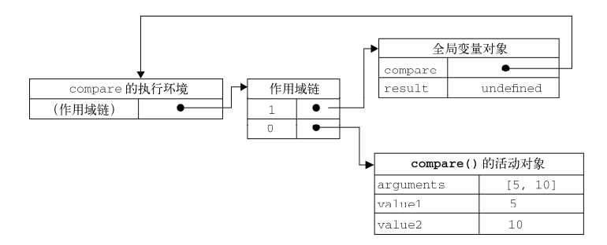
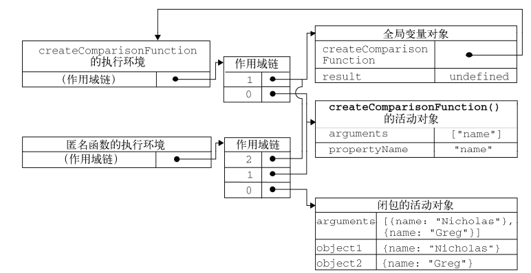

### 作用域链

在红宝书中对作用域链的描述有这么一段话：当代码在一个环境中执行时，会创建变量对象的一个作用域链。作用域链的用途是保证对执行环境有权访问的所有变量和函数的有序访问。作用域链的前端始终是当前执行的代码所在环境的变量对象。如果这个环境是函数，则将其活动对象作为变量对象。活动对象在最开始时只包含一个变量，即 arguments 对象。作用域链的下一个变量对象来自包含环境，而在下一个变量对象则来自下一个包含环境。这样一直延续到全局执行环境；全局执行环境的变量对象始终都是作用域链中的最后一个对象。
这里面有很多概念，比如什么是执行环境、变量对象等。先说明一下这些概念的理解

### 执行环境(Execution Context)

执行环境是 JavaScript 中的重要概念之一。执行环境定义了变量或函数有权访问的其他数据，决定了他们各自的行为。每个执行环境都有一个与之关联的变量对象，环境中定义的所有变量和函数都保存在这个对象中。
全局执行环境是最外围的一个执行环境。在 Web 浏览器中，全局执行环境被认为是 window 对象，因此所有全局变量和函数都是作为 window 对象的属性和方法创建的。某个执行环境中的所有代码执行完毕后，该环境被销毁，保存在其中的所有变量和函数定义也随之销毁（全局执行环境知道应用程序退出–例如关闭网页或浏览器—时才会被销毁）
每个函数都有自己的执行环境。当执行流进入一个函数时，函数的环境就会被推入一个环境栈中。而在函数执行后，栈将其环境弹出，把控制权返回给之前的执行环境。
执行环境的建立分为两个阶段：进入执行上下文（创建阶段）和执行阶段（激活/执行阶段）

- （1）进入上下文阶段：发生在函数调用时，但在执行具体代码之前。具体完成创建作用域链；创建变量、函数和参数以及求 this 的值
- （2）执行代码阶段：主要完成变量赋值、函数引用和解释/执行其他代码
  总的来说可以将执行上下文看作是一个对象

```js
EC = {
VO:{/_函数中的 arguments 对象、参数、内部变量以及函数声明_/}
this:{},
Scope:{/_VO 以及所有父执行上下文中的 VO_/}
}
```

### 变量对象(Variable Object）

每一个执行环境都对应一个变量对象，在该执行环境中定义的所有变量和函数都存放在其对应的变量对象中。

- （1）进入执行上下文时，VO 的初始化过程如下：

  函数的形参：变量对象的一个属性，其属性名就是形参的名字，其值就是实参的值；对于没有传递的参数，其值为 undefined；

  函数声明：变量对象的一个属性，其属性名和属性值都是函数对象创建出来的，如果变量对象已经办好了相同名字的属性，则替换它的值

  变量声明：变量对象的一个属性，其属性名即为变量名，其值为 undefined；如果变量名和已经声明的函数名或者函数的参数名，则不会影响已经存在的属性

- （2）执行代码阶段，变量对象中的一些属性 undefined 值将会确定

这里需要说明一下：函数表达式不包含在变量对象之中

```js
var foo = 10;

function bar() {} // function declaration, FD
(function baz() {}); // function expression, FE

console.log(
  this.foo == foo, // true
  window.bar == bar // true
);

console.log(baz); // ReferenceError, "baz" is not defined
```

之后，全局上下文的变量对象为


### 活动对象

当函数被调用的时候，一个特殊的对象–活动对象将会被创建。这个对象中包含形参和 arguments 对象。活动对象之后会作为函数上下文的变量对象来使用。换句话说，活动对象除了变量和函数声明之外，它还存储了形参和 arguments 对象。

### 作用域详解

由以上介绍可知，当某个函数被调用时，会创建一个执行环境及相应的作用域链。然后，使用 arguments 和其他命名参数的值来初始化函数的活动对象。但在作用域链中，外部函数的活动对象始终处于第二位，外部函数的外部函数对象处于第三位……直至作为作用域终点的全局执行环境

```js
function compare(value1, value2) {
  if (value1 < value2) {
    return -1;
  } else if (value1 > value2) {
    return 1;
  } else {
    return 0;
  }
}
```

以上代码定义了 compare()函数，然后又在全局作用域中调用了它。当调用 compare()时，会创建一个包含 arguments、value1、value2 的活动对象。全局执行环境的变量对象（包含 result 和 compare）在 compare()执行环境的作用域链中则处于第二位。下图包含了上述关系的 compare()函数执行时的作用域链



后台的每个执行环境都有一个表示变量的对象——变量对象。全局环境的变量对象始终存在，而像 compare()函数这样的局部环境的变量对象，则只在函数执行的过程中存在。在创建 compare()函数时，会创建一个预先包含全局变量对象的作用域链，这个作用域链会被保存在内部的[[Scope]]属性中。当调用 compare()函数时，会为函数创建一个执行环境，然后通过赋值函数的[[Scope]]属性中的对象构建起执行环境的作用域链。此后，又有一个活动对象别创建并被推入执行环境作用域链的前端。对于这个例子中，compare()函数的执行函数而言，其作用域链中包含两个变量对象：本地活动对象和全局便朗对象。作用域链本质上是一个指向变量对象的指针列表，它只引用但不实际包含变量对象。

闭包与作用域链
无论什么时候在函数中访问一个变量时，就会从作用域链中搜索具有相应名字的变量。一般来讲，当函数执行完毕后，局部活动对象就会被销毁，内存中仅保存全局作用域（全局执行环境的变量对象）。但是闭包的情况又有所不同。

```js
function createComparisionFunction(propertyName) {
  return function(object1, object2) {
    var value1 = object1[propertyName];
    var value2 = object2[propertyName];
    if (value1 < value2) {
      return -1;
    } else if (value1 > value2) {
      return 1;
    } else {
      return 0;
    }
  };
}
```

在另一个函数内部定义的函数会将包含函数（即外部函数）的活动对象添加到它的作用域链中。因此，在 createComparisonFunction()函数内部定义的匿名函数作用域链中，实际上将会包含外部函数 createComparisonFunction()的活动对象。

```js
var compare = createComparisonFunction("name");
var result = compare({ name: "Nicolas" }, { name: "Greg" });

//解除对匿名函数的引用，以便释放内存
compareName = null;
```

当上述代码执行时，下图展示了包含函数与内部匿名函数的作用域链



在匿名函数从 createComparisonFunction()中被返回后，它的作用域链被初始化为包含 createComparisonFunction()函数的活动对象和全局变量对象。这样，匿名函数就可以访问在 createComparisonFunction()中定义的所有变量。更为重要的是， createComparisonFunction()函数在执行完毕后，其活动对象也不会被销毁，因为匿名函数的作用域链仍然在引用这个活动对象。即当 createComparisonFunction()函数返回后，其执行环境的作用域链会被销毁，但它的活动对象任然会留在内存中；直到匿名函数被销毁后，createComparisonFunction()的活动对象才会被销毁。

作用域链知识总结
当代码在一个环境中执行时，都会创建一个作用域链。 作用域链的用途是保证对执行环境有权访问的所有变量和函数的有序访问。整个作用域链的本质是一个指向变量对象的指针列表。作用域链的最前端，始终是当前正在执行的代码所在环境的变量对象。
　　如果这个环境是函数，则将其活动对象（activation object)作为变量对象。活动对象在最开始时只包含一个变量，就是函数内部的 arguments 对象。作用域链中的下一个变量对象来自该函数的包含环境，而再下一个变量对象来自再下一个包含环境。这样，一直延续到全局执行环境，全局执行环境的变量对象始终是作用域链中的最后一个对象。

原文链接：[JavaScript 中的作用域链详解](https://blog.csdn.net/charlene0824/article/details/52252824)
