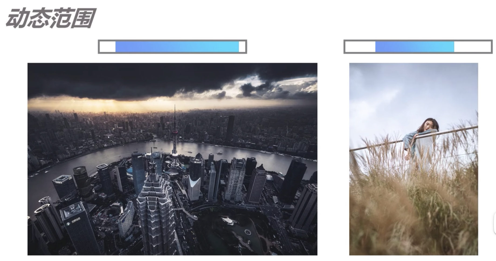
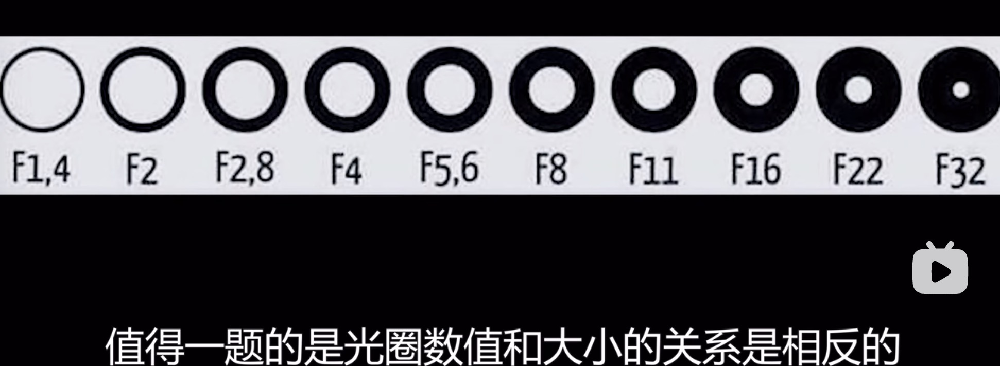

## 相机相关知识

- 宽容度是指相机本身能够容纳记录的从最亮到最暗的范围；
- 动态范围是指成像照片或者现场场景中最亮到最暗的范围；

灰色区域是相机的宽容度，蓝色区域是动态范围，也就是照片中最亮和最暗的范围；

- 转接环 指的是相机和镜头不是一个品牌或品种 可以进行转接

图片格式：

RAW 格式后期调整图片可调整空间大，Jpg 方便预览和发朋友圈

联机拍摄-capsular one 软件
可以实时的在电脑上看

---

相机设置思路： 设置双卡记录/设置 RAW 格式记录/关闭长时间曝光降噪

---

光圈---》快门----》ISO

- 大光圈，进入的光多；
- 小光圈，进入的光少；
- 快门越快，进入的光少；
- 快门越慢，进入的光多；

ISO 靠电子信号提高感光板的亮度

F1.4 光圈 数值和光圈大小成反比

1/3000 快门速度

室内提高亮度
放大光圈---》降低快门---》增加 ISO

室外降低亮度
减少 ISO---》加快快门---》调整小光圈

大光圈---》背景虚化
清晰的区域叫做景深，大光圈时，清晰的区域（红色部分）大叫做浅景深，小光圈清晰的区域小叫做深景深；

多人合照用小光圈，深景深；
大光圈---》容易导致背景虚化

前景深可以使用树叶等遮挡，虚化前景深

光线不足的时候，使用自动挡照相，快门自动变慢，咔。。。嚓，是因为 ISO 和光圈已经调整到最大，只能放慢快门，这个过程中如果手痘，容易导致画面模糊。

在阳光充足的室外，拍摄背景虚化、动态模糊的照片；

- 背景虚化--》大光圈
  动态模糊--》慢快门
  光线充足--》降低 ISO、快速快门、小光圈

综上：大光圈、慢快门、降低 ISO，

即使降低到最小的 ISO 也无法降低亮度，使用 ND 滤镜

---——————————

M 档（手动模式 ）

### AV 档（光圈优先）

一般用在背景虚化的情况，如微距、人像、特写等。（在光线好，大光圈）

如果光线不好，进光量不足会导致，相机自动调慢快门，导致照片模糊

### S 档或 TV 档（快门优先）

一般用户慢速快门（拍车流）或者快速抓怕（动态清晰照片）的时候

### P 档（自动模式）

光圈和快门控制其中一个，则相机自动调整另外一个

以上说的都会在 ISO 自动的模式下：

曝光补偿是在现有的基础上进行微调，+1 或者-1

情况分析：

- 如果是正常不急的拍摄，全部 M 首手动挡拍摄；
- 商业活动拍摄
  - 光线好，或者自己带灯，用 AV 档，亮度不足的时候 调整曝光补偿
  - 争分夺秒的抓拍，则用 TV 档

## 直方图

相机自带的功能

## 构图

- 三分法构图
  

- 对角线构图
  

- 三角构图
  

- 三角中心对称构图
  

### 1、清除背景、除杂，清除背景中不需要的杂物，放大光圈虚化背景、或者只拍摄一部分。

- 调整取景角度

  

- 开大光圈虚化背景
  

- 放大画面规避杂乱

### 2、视角独特

- 从低向上拍 给人高高在上，感觉高贵

- 从上向下拍 给人娇小，可爱风
  

- 从远处拍， 像是陌生人
  

- 近距离拍，就像朋友，亲切近人
  

- 推脸拍摄

- 光景拍摄

- 空间延伸线
  

- 空间堆叠 看起来更有层次感
  

- 添加前置遮挡
  

## 进阶构图

- 突出人物主体
  色彩强弱、光影明暗、空间虚实、明显的引导线

  

- 平衡画面中心
  重心失衡，一面太空
  
  对比：
  

- 不要切脑袋、砍四肢这种低级错误

  

- 保证人物脸上的光均匀

### 白平衡

相机是根据黑白色为依据推断其他颜色的，所以需要找准黑色和白色。白平衡就是告诉相机哪个是正确的白色，

不同光对应的颜色

相机里调整对应的数值匹配环境的色值；

## 测光

调整光线的亮暗

- 评价测光：相当于画面中亮度取平均值；
- 中央测光：以画面中间的亮度为依据来判断亮度；
- 点测光： 以画面中某一点

亮度锁

## 对焦

- 1、调整光圈大小
- 2、调整对焦环
- 3、调整相机和物体间的位置
