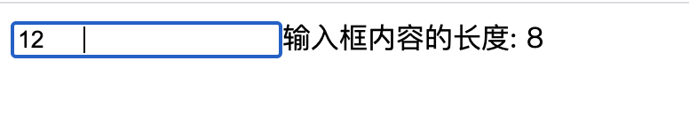

## 表单输入绑定

v-model 指令在表单 `<input>`、`<textarea>` 及 `<select>` 元素上创建双向数据绑定

- 1、v-model 绑定的值通常是string：文本input、多行文本textarea、单选框 (Radio)、选择框 (Select)
- 2、v-model 绑定的值通常是boolean值：单个复选框Checkbox
- 3、v-model 绑定的值通常是数组：多个复选框、多个选择框 (Select-multiple)

### 文本

```vue
<template>
    <div class="wraper">
      <input v-model="message" placeholder="edit me" />
      <p>Message is: {{ message }}</p>
    </div>
</template>
<script>
export default {
  data(){
    return{
     message:'',
    }
  }
}
</script>
```

### 多行文本textarea

```vue
<template>
    <div class="wraper">
      <span>Multiline message is:</span>
      <p style="white-space: pre-line;">{{ message }}</p>
      <br />
      <textarea v-model="message" placeholder="add multiple lines"></textarea>
    </div>
</template>
<script>
export default {
  data(){
    return{
     message:'',
    }
  }
}
</script>
```

### 复选框 (Checkbox)

**1、单个复选框，绑定到布尔值**

```vue
<template>
    <div class="wraper">
      <input type="checkbox" id="checkbox" v-model="checked" />
      <label for="checkbox">{{ checked }}</label>
    </div>
</template>
<script>
export default {
  data(){
    return{
     checked:false,
    }
  }
}
</script>
```

**2、多个复选框，绑定到同一个数组**

```vue
<template>
    <div class="wraper">
        <input type="checkbox" id="jack" value="JackValue" v-model="checkedNames" />
        <label for="jack">Jack</label>
        <input type="checkbox" id="john" value="JohnValue" v-model="checkedNames" />
        <label for="john">John</label>
        <input type="checkbox" id="mike" value="MikeValue" v-model="checkedNames" />
        <label for="mike">Mike</label>
        <br />
        <span>Checked names: {{ checkedNames }}</span>
    </div>
</template>
<script>
export default {
  data(){
    return{
     checkedNames:[], //显示选中的value值
    }
  }
}
</script>
```

### 单选框 (Radio)

**使用同一个字符串**

```vue
<template>
    <div class="wraper">
      <input type="radio" id="one" value="One" v-model="picked" />
      <label for="one">One</label>
      <br />
      <input type="radio" id="two" value="Two" v-model="picked" />
      <label for="two">Two</label>
      <br />
      <span>Picked: {{ picked }}</span>
    </div>
</template>
<script>
export default {
  data(){
    return{
     picked:'', //显示选中的value值
    }
  }
}
</script>
```

### 选择框 (Select)

select选择框，model放在select上。

```vue
<template>
    <div class="wraper">
      <select v-model="selected">
        <option v-for="option in options" :value="option.value" :key="option.value">
          {{ option.text }}
        </option>
      </select>
      <span>Selected: {{ selected }}</span>
    </div>
</template>
<script>
export default {
  data(){
    return{
      selected: 'A',
      options: [
        { text: 'One', value: 'A' },
        { text: 'Two', value: 'B' },
        { text: 'Three', value: 'C' }
      ]
    }
  }
}
</script>
```
### v-model上的修饰符

**.lazy**
默认：v-model，每次修改输入框的值则与数据同步；
使用 `.lazy` 后，则在change事件后再数据同步；[光标离开input后，才触发同步数据]

```vue
<template>
    <div class="wraper">
      <input v-model.lazy="msg" />
      <span>msg: {{ msg }}</span>
    </div>
</template>
<script>
export default {
  data(){
    return{
      msg: '',
    }
  }
}
</script>
```
**.number**

可以将用户的输入值转为数值类型，type="number"只能限制输入的是number，但是返回的数据是string

```vue
<template>
    <div class="wraper">
      <input v-model.number="age" type="number" />
      <span>msg: {{ age }}</span>
    </div>
</template>
<script>
export default {
  data(){
    return{
      age: 0,
    }
  },
  updated(){
    console.log(typeof(this.age));//number类型
  }
}
</script>
```

**.trim**

可以自动过滤用户输入的首尾空白字符

```vue
<template>
    <div class="wraper">
      <input v-model="msg" />
      <span>输入框内容的长度: {{ msg.length }}</span>
    </div>
</template>
<script>
export default {
  data(){
    return{
      msg: '',
    }
  }
}
</script>
```

结果如下，会把空格也计算进去：




### v-model在组件上的应用

在组件上使用 v-model，相当于：

```html
<custom-input
  :model-value="searchText"
  @update:model-value="searchText = $event"
></custom-input>
```
对比vue2有以下改变：
- 1、更改为 由 input 事件更改为 update 事件;
- 2、可以自定义 model 事件;
- 3、在同一个组件上使用多个 v-model;

```vue
<template>
  <div>
      <p>父组件：{{msg}}</p>
      <Child v-model="msg"></Child>
  </div>
</template>
<script>
import Child from './components/child.vue'
import { ref } from "vue";
export default {
  name: 'App',
  components: {
    Child
  },
  setup(){
    const msg = ref('我是父组件内容');
    return {
      msg
    }
  }
}
</script>
```
子组件使用了默认的`modelValue`

```vue
<template>
  <div>
    <div class="my-content">我是子组件内容:{{modelValue}}</div>
    <button @click="$emit('update:modelValue','new value')">点击我</button>
  </div>
</template>
<script>
import {ref,onMounted,nextTick} from 'vue' 
export default {
  props:{ //这里声明props
    modelValue:String,
  }
}
</script>
```

自定义model的名字,并且支持同一个元素中多个v-model,如下定义了两个v-model

```vue
<template>
  <div>
      <p>父组件：{{msg}}---{{modelValue}}</p>
      <Child v-model:myModel="msg" v-model:modelValue="modelValue"></Child>
  </div>
</template>
<script>
import Child from './children/child.vue'
import { ref } from "vue";
export default {
  name: 'App',
  components: {
    Child
  },
  setup(){
    const msg = ref('我是父组件内容');
    const modelValue = ref("parenter content");
    return {
      msg,
      modelValue
    }
  }
}
</script>
```
子组件

```vue
<template>
  <div>
    <div class="my-content">我是内容{{myModel}}---{{modelValue}}</div>
    <input type="text" @input="$emit('update:modelValue',$event.target.value)" />
    <button @click="$emit('update:myModel','new value')">点击我</button>
  </div>
</template>
<script>
import {ref,onMounted,nextTick} from 'vue' 
export default {
  props:{ //这里声明props
    myModel:String,
    modelValue:String,
  },
  setup(props,cxt){
    console.log(props.myModel);
  }
}
</script>
```