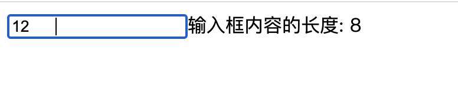

:::details  问题自检
- 1、vue中的data为什么要写成函数形式？
- 2、methods函数和计算属性computed的区别和联系？
- 3、你了解侦听器watch中immediate 和 handler、deep的用途吗？
- 4、你了解 Class 分为对象、数组语法有哪些具体使用方式吗？
- 5、v-for 可以用来渲染对象吗？你知道他有几个入参吗？分别代码什么含义呢？
- 6、vue3为什么可以监听数组和对象的变化了？
- 7、你知道常用的事件修饰符有哪些吗？
- 8、你知道v-model在组件上是如何应用的吗？
:::

## 创建vue实例

传递给 createApp 的选项用于配置根组件。当我们挂载应用时，该组件被用作渲染的起点。

```js
import { createApp } from 'vue'
//省略引入的组件路径
createApp(App) //APP是入口组件，所有的组件在该组件中设置
    .component('SearchInput', SearchInputComponent) //全局组件
    .directive('focus', FocusDirective) //全局指令
    .use(router) //使用路由插件
    .mount('#app')
```

## 模版语法

用法速览：
```vue
<template>
    <!--文本插值,支持js单个表达式-->
    <span>Message: {{ message.split('').reverse().join('')}}</span>
    <span v-once>这个将不会改变: {{ msg }}</span><!--一次性地插值,后续不会更新-->
    <span :html="rawHtml"></span><!--将rawHtml变量渲染为HTML-->
    <div :id="dynamicId"></div><!--将dynamicId变量渲染为元素属性-->
    <a @click="doSomething"> ... </a><!--监听事件-->
    <!--动态参数:用方括号括起来,如attributeName可以为 blur||focus-->
    <a v-on:[attributeName]="doSomething"> ... </a>
    <!--修饰符:是以半角句号.指明的特殊后缀，用于指出一个指令应该以特殊方式绑定-->
    <form v-on:submit.prevent="onSubmit">...</form>
</template>
```

## data属性

**组件的 data 选项是一个函数**，这样每一个实例的data属性都是独立的，不会相互影响。

然后data对象，以 $data 的形式存储在组件实例中，为方便起见，该对象的任何顶级 property 也直接通过组件实例暴露出来：

入口js，可以调用组件的data数据
```js
import { createApp } from 'vue'
import App from './App.vue'
const vm =createApp(App).mount('#app')
console.log(vm.$data.count); //获取顶级组件App中的data，无法获取App中再包裹的子组件的data
vm.count = 15;//改变组件中的data值
```
app.vue 入口组件中返回函数形式定义data数据：
```vue
<template>
  <div>{{count}}</div>
</template>
<script>
export default {
  name: 'App',
  data(){
    return {
      count:4
    }
  }
}
</script>
```

::: warning 注意
vue3兼容了vue2的写法，vue3对响应式的数据如：ref、reactive等方式是放在了setup函数中，而setup相当于生命周期中最早执行的部分。上面例子就是兼容了vue2的写法。vue3中新增的setup方法会在后面介绍。
:::

## methods方法

- 使用方式一：事件监听使用，如 `@click="changeCount"`;
- 使用方式二：直接从模板中调用方法 `computedData`，类似于后面介绍的**计算属性**

```vue
<template>
  <h2>{{computedData(count)}}</h2>
  <button @click="changeCount">改变count</button>
</template>
<script>
export default {
  name: 'App',
  data(){
    return {
      count:4
    }
  },
  methods:{
    computedData(count){
      return count+'change'
    },
    changeCount(){
      this.count++
    }
  }
}
</script>
```
:::tip 注意1
从模板调用的方法不应该有任何副作用，比如"更改数据"或"触发异步进程"。这些应该放在生命周期钩子中。
:::
因为用作"模板调用的方法"相当于计算属性，会监听数据变化再次触发该方法，这样就会导致死循环！
template模板调用的方法--->执行模板调用的方法，改变data数据--->触发模板调用的方法--->执行模板调用的方法，改变data数据--->陷入死循环

```vue
<template>
  <h2>{{computedData(count)}}</h2><!--模板调用的方法-->
</template>

<script>
export default {
  name: 'App',
  data(){
    return {
      count:4
    }
  },
  methods:{
    computedData(count){//在"模板调用的方法"更改数据,导致死循环
      this.count++
      return count+'change'
    }
  }
}
</script>
```

:::tip 注意2
Vue 自动为 methods 绑定 this，以便于它始终指向组件实例。这将确保方法在用作事件监听或回调时保持正确的 this 指向。
:::

在定义 methods 时应避免使用箭头函数，因为这会阻止 Vue 绑定恰当的 this 指向。

```js
methods:{
    changeCount:()=>{ //使用箭头函数定义，会报错
        this.count++ 
    }
}
```

## 计算属性

通过其他变量计算得到得到另外一个属性，对于任何包含响应式数据的复杂逻辑，使用计算属性。

由于和“模板调用的方法”类似，这里做对比：
使用计算属性 computedData 和方法 handleData 计算数据复杂逻辑之后的值，区别在于

- 1. 计算属性相当于逻辑处理后的data，具有响应式，以值的形式放在 template 中；而methods，需要在template中执行函数。**方法可以传参/计算属性无法传参。**
- 2. 计算属性是有缓存的，除非依赖的响应数据发生变化才会重新取值；而 methods 每次使用都会重新取值。

```vue
<template>
  <h3 v-for="(item,index) in [1,2,3,4]" :key="index">{{total}}</h3>
  <button @click="changeCount">改变count</button>
  <h4 v-for="(item,index) in [1,2,3,4]" :key="index">{{handleTotal()}}</h4>
</template>
<script>
export default {
  name: 'App',
  data(){
    return {
      count:0
    }
  },
  computed:{
    total(){
      console.log('触发计算属性');
      return this.count+'computed'
    }
  },
  methods:{
    handleTotal(count){
      console.log('触发方法');
      return this.count+'change'
    },
    changeCount(){
      this.count++
    }
  }
}
</script>
```
如下图可以看到，多次使用了computed，只会执行一次，具有缓存


再比如计算属性中有大量的计算逻辑，如多层循环，则有缓存可以大量减少重复计算问题。

```js
computed:{
    total() {
        console.log('触发计算属性');
        var vel=this.val;
        var sum=0,len=vel.length;
        for(var i=0;i<len;i++){
            sum+=vel[i]
        }
        return sum;
    }
}
```
**计算属性的setter和getter**

计算属性的set和get可以进一步的设置计算属性，此外

```vue
<template>
  <div>
      <p>fullName值: {{fullName}}</p>
      <button @click="ClickComputed">点击改变fullName的值</button>
  </div>
</template>
<script>
export default {
  data () {
    return {
      firstName: 'Foo'
    }
  },
  methods: {
    ClickComputed () {
      this.fullName = 'fullName 的新值'
    }
  },
  mounted(){
    this.fullName = 'tom lili'
  },
  computed: {
    fullName: {
      get: function () {
        return this.firstName + ':'+ this.lastName
      },
      set: function (newValue) {
        const names = newValue.split(' ')
        this.firstName = names[0]
        this.lastName = names[names.length - 1]
      }
    }
  }
}
</script>
```

## 侦听器

**1、方法一：监听变量**

>第一次绑定的时候，不会执行监听函数，只有值发生改变才会执行

```vue
<template>
  <div>
      <p>fullName值: {{fullName}}</p>
      <button @click="ClickName">点击改变fullName的值</button>
  </div>
</template>
<script>
export default {
  data () {
    return {
      fullName: 'old值'
    }
  },
  methods: {
    ClickName () {
      this.fullName = 'new新值'
    }
  },
  watch:{
    fullName(newVal,oldVal){
      console.log(newVal,oldVal)
    }
  }
}
</script>
```
**2、使用 immediate 和 handler**

>第一次绑定的时候，就会执行监听函数

immediate表示在watch中首次绑定的时候，是否执行handler，

值为true则表示在watch中声明的时候，就立即执行handler方法，

值为false，则和一般使用watch一样，在数据发生变化的时候才执行handler。

```vue
<template>
  <div>
      <p>fullName值: {{fullName}}</p>
      <button @click="ClickName">点击改变fullName的值</button>
  </div>
</template>
<script>
export default {
  data () {
    return {
      fullName: 'old值'
    }
  },
  methods: {
    ClickName () {
      this.fullName = 'new新值'
    }
  },
  watch:{
    fullName:{
      handler(newVal,oldVal){
        console.log(newVal,oldVal)
      },
      immediate:true
    }
  }
}
</script>
```

**3、深度监听deep**

当需要监听一个对象/数组的改变时，普通的watch方法无法监听到对象内部属性的改变，此时就需要deep属性对对象进行深度监听。

```vue
<template>
  <div>
      <p>{{fullName.firstName}}:{{fullName.lastName}}</p>
      <button @click="ClickName">点击改变fullName的值</button>
  </div>
</template>
<script>
export default {
  data () {
    return {
      fullName: {
        firstName:'li',
        lastName:'mei'
      }
    }
  },
  methods: {
    ClickName () {
      this.fullName.firstName = '王'
    }
  },
  watch:{
    fullName:{
      handler(newVal,oldVal){
        console.log(newVal,oldVal)
      },
      deep:true
    }
  }
}
</script>
```

如确定监听某个属性，可以按照以下形式：

```js
watch:{
    'fullName.firstName'(newVal,oldVal){
        console.log(newVal,oldVal)
    }
}
```

## Class 与 Style 绑定

:::warning 注意
对象语法中，{key:value}中key，可以带引号，也可以不带引号，都会渲染成 class 类名，
比如:class="{textColor: isActive }" 在 isActive = true时，渲染成 class="textColor",
不同于在数组中 :class="[activeClass, basedClass]"，activeClass会被渲染成对应的data值。
:::

### 对象语法

```vue
<template>
  <div>
      <!--对象语法-->
      <div :class="{ 'textColor': isActive }">对象语法</div>
      <!--对象中传入多个字段来动态切换多个class-->
      <div
        class="based"
        :class="{ textColor: isActive, 'bg-color': hasBgColor }"
      >对象中传入多个字段来动态切换多个class</div>
      <!--绑定的数据对象放在data中-->
      <div :class="classObject">绑定的数据对象放在js中</div>
      <!--绑定的数据对象放在计算属性中-->
      <div :class="classComputed">绑定的数据对象放在计算属性中</div>
      <!--点击按钮改变变量-->
      <button @click="ClickName">点击改变fullName的值</button>
  </div>
</template>
<script>
export default {
  data () {
    return {
      isActive:false,
      hasBgColor:false,
      classObject:{
        'textColor': true,
      }
    }
  },
  computed:{
    classComputed(){
      return {
        'textColor': true,
      }
    }
  },
  methods: {
    ClickName () {
      this.isActive = true;
      this.hasBgColor = true;
    }
  }
}
</script>
<style>
.textColor{
  color:red;
}
.based{
  font-size: 20px;
}
.bg-color{
  background: yellow;
}
</style>
```

### 数组语法

```vue
<template>
  <div>
      <!--数组语法-->
      <div :class="[activeClass, basedClass]">数组语法</div>
      <!--三元表达式切换class-->
      <div :class="[isActive ? activeClass : '', basedClass]">三元表达式</div>
      <!--数组语法中也可以使用对象语法-->
      <div :class="[{ activeClass: isActive }, basedClass]">数组语法中也可以使用对象语法</div>
      <button @click="ClickName">点击改变fullName的值</button>
  </div>
</template>
<script>
export default {
  data () {
    return {
      activeClass:'textColor',
      basedClass:'based',
      isActive:false,
    }
  },
  methods: {
    ClickName () {
      this.isActive=true;
    }
  }
}
</script>
<style>
.textColor{
  color:red;
}
.based{
  font-size: 20px;
}
.bg-color{
  background: yellow;
}
</style>
```

### 组件上使用

父组件上使用class，会默认挂载到子组件的根元素上！如果想指定到某个元素上，使用以下方式：

父组件上定义class
```vue
<template>
  <MyComponent class="foo"></MyComponent>
</template>
<script>
import MyComponent from './components/MyComponent.vue'
export default {
  components:{
    MyComponent
  }
}
</script>
```
子组件使用$attrs指定继承位置，并且使用 `inheritAttrs: false` 消除默认继承位置。

```vue
<template>
  <div>
      <p :class="$attrs.class">我是子组件内容</p>
  </div>
</template>
<script>
export default {
  name: 'MyComponent',
  inheritAttrs: false, //这里
}
</script>
```

## 内联样式
分为对象语法和数组语法，渲染style
```vue
<template>
  <div>
    <!--对象语法-->
    <div :style="{ color: activeColor, fontSize: currFontSize + 'px' }">对象语法1</div>
    <div :style="styleObject">对象语法2</div>
    <!--数组语法-->
    <div :style="[styleObject, activeObject]">数组语法</div>
  </div>
</template>
<script>
export default {
  data(){
    return {
      activeColor:'red',
      currFontSize:22,
      styleObject:{
        color:'yellow'
      },
      activeObject:{
        background:'green'
      }
    }
  }
}
</script>
```

## 条件渲染

使用template可以切换多个元素 `v-if/v-else-if/else`

```vue
<template>
  <div>
   <template v-if="ok">
    <h1>Title</h1>
    <p>Paragraph 1</p>
    <p>Paragraph 2</p>
  </template>
  <div v-else>我是内容</div>
  <button @click="switchStatus">切换状态</button>
  </div>
</template>
<script>
export default {
  data(){
    return {
      ok:false
    }
  },
  methods:{
    switchStatus(){
      this.ok = !this.ok;
    }
  }
}
</script>
```
:::tip  v-if和v-show的区别
v-if 有更高的切换开销，而 v-show 有更高的初始渲染开销。因此，如果需要非常频繁地切换，则使用 v-show 较好；如果在运行时条件很少改变，则使用 v-if 较好。
:::

:::warning 注意
2.x 版本中在一个元素上同时使用 v-if 和 v-for 时，v-for 会优先作用。
3.x 版本中 v-if 总是优先于 v-for 生效。
由于语法上存在歧义，建议避免在同一元素上同时使用两者。
:::

先判断 v-if 导致 找不到 item，如果改成 list.length > 1 即可显示出来。

```vue
<template>
    <div class="wraper">
      <div v-for="(item,index) in list" v-if="item>1" :key="index">
          <div>{{item}}<div>
      </div>
    </div>
</template>
<script>
import {ref} from 'vue'
export default {
  data(){
    return{
      list:ref([1,2,3,4,5])
    }
  }
}
</script>
```

## 列表渲染

`v-for`既可以用来渲染数组，也可以用来渲染对象。注意for循环对象时：value 在前，key值在后，index在最后。

>注意写上key值

```vue
<template>
    <div class="wraper">
      <ul id="v-for-object" class="demo">
        <li v-for="(value,key,index) in myObject" :key="key">
          {{index}}:{{key}}--{{ value }}
        </li>
      </ul>
    </div>
</template>
<script>
import {ref} from 'vue'
export default {
  data(){
    return{
     myObject: {
        title: 'How to do lists in Vue',
        author: '小王',
        time: '2020-11-11'
      }
    }
  }
}
</script>
```

### 数组变化检测

Vue3 中可以检测数组和对象的变化

```js
//vue2的响应式原理
Object.defineProperty(data,'count',{
    get(){},
    sert(){}
})
//vue3的响应式原理
new Proxy(data,{
    get(key){},
    set(key,value){}
})
```

:::tip 注意
vue2中必须传入对应的key值，才能进行拦截数据，但是数组对象动态变化，则无法监听；
vue3中传入data即可监听里面数据的变化，所以可以监听数组对象的动态变化
:::

```vue
<template>
  <div>
      <ul>
        <li v-for="(item,index) in desc" :key="index">{{item.name}}--{{item.age}}</li>
      </ul>
      <p>{{obj.name}}--{{obj.age}}</p>
      <button @click="clickme">点击me</button>
  </div>
</template>
<script>
import {ref} from 'vue' 
export default {
  setup(){
    const desc = ref([
      {
      name:'xiaohua',
      age:12
      },
      {
      name:'xiaowang',
      age:22
      }
    ]);
    const obj = ref({
      name:"lili"
    });
    function clickme (){
      desc.value[2] = {
        name:"小王",
        age:33
      }
      obj.value.age = 24
    }
    return {
      obj,
      desc,
      clickme
    }
  }
}
</script>
```

## 事件处理

我们可以使用 v-on 指令 (通常缩写为 @ 符号) 来监听 DOM 事件，并在触发事件时执行一些简单的 JS。
注意 alert/console 等方法不能在template中执行，请放在`<script>`标签内执行。
此外当一个 ViewModel 被销毁时，所有的事件处理器都会自动被删除。你无须担心如何清理它们。

- 1、直接绑定到一个方法：`<button @click="say">Say hi</button>`
- 2、内联 JavaScript 语句中调用方法：`<button @click="say('hi')">Say hi</button>`
- 3、使用特殊变量 $event 传入方法：`<button @click="say($event)">Say hi</button>`
- 4、多事件处理器：`<button @click="one($event), two($event)">`

### 事件修饰符

```html
<!-- 阻止单击事件继续传播 -->
<a @click.stop="doThis"></a>

<!-- 提交事件不再重载页面 -->
<form @submit.prevent="onSubmit"></form>

<!-- 修饰符可以串联 -->
<a @click.stop.prevent="doThat"></a>

<!-- 只有修饰符 -->
<form @submit.prevent></form>

<!-- 添加事件监听器时使用事件捕获模式 -->
<!-- 即内部元素触发的事件先在此处理，然后才交由内部元素进行处理 -->
<div @click.capture="doThis">...</div>

<!-- 只当在 event.target 是当前元素自身时触发处理函数 -->
<!-- 即事件不是从内部元素触发的 -->
<div @click.self="doThat">...</div>

<!-- 点击事件将只会触发一次 -->
<a @click.once="doThis"></a>

<!-- 只有在 `key` 是 `Enter` 时调用 `vm.submit()` -->
<input @keyup.enter="submit" />
```
其他按键修饰符，此处不再赘述，详情见[官方文档](https://v3.cn.vuejs.org/guide/events.html#%E6%8C%89%E9%94%AE%E4%BF%AE%E9%A5%B0%E7%AC%A6)

Vue 还对应 addEventListener 中的 passive 选项提供了 .passive 修饰符。这个 .passive 修饰符尤其能够提升移动端的性能。

`<div @scroll.passive="onScroll">...</div>`

详细讲解请见：[addEventListener 中的 passive 用法](http://maying.ink/2018/12/21/passive/)

## 表单输入绑定

v-model 指令在表单 `<input>`、`<textarea>` 及 `<select>` 元素上创建双向数据绑定

- 1、v-model 绑定的值通常是string：文本input、多行文本textarea、单选框 (Radio)、选择框 (Select)
- 2、v-model 绑定的值通常是boolean值：单个复选框Checkbox
- 3、v-model 绑定的值通常是数组：多个复选框、多个选择框 (Select-multiple)

### 文本

```vue
<template>
    <div class="wraper">
      <input v-model="message" placeholder="edit me" />
      <p>Message is: {{ message }}</p>
    </div>
</template>
<script>
export default {
  data(){
    return{
     message:'',
    }
  }
}
</script>
```

### 多行文本textarea

```vue
<template>
    <div class="wraper">
      <span>Multiline message is:</span>
      <p style="white-space: pre-line;">{{ message }}</p>
      <br />
      <textarea v-model="message" placeholder="add multiple lines"></textarea>
    </div>
</template>
<script>
export default {
  data(){
    return{
     message:'',
    }
  }
}
</script>
```

### 复选框 (Checkbox)

**1、单个复选框，绑定到布尔值**

```vue
<template>
    <div class="wraper">
      <input type="checkbox" id="checkbox" v-model="checked" />
      <label for="checkbox">{{ checked }}</label>
    </div>
</template>
<script>
export default {
  data(){
    return{
     checked:false,
    }
  }
}
</script>
```

**2、多个复选框，绑定到同一个数组**

```vue
<template>
    <div class="wraper">
        <input type="checkbox" id="jack" value="JackValue" v-model="checkedNames" />
        <label for="jack">Jack</label>
        <input type="checkbox" id="john" value="JohnValue" v-model="checkedNames" />
        <label for="john">John</label>
        <input type="checkbox" id="mike" value="MikeValue" v-model="checkedNames" />
        <label for="mike">Mike</label>
        <br />
        <span>Checked names: {{ checkedNames }}</span>
    </div>
</template>
<script>
export default {
  data(){
    return{
     checkedNames:[], //显示选中的value值
    }
  }
}
</script>
```

### 单选框 (Radio)

**使用同一个字符串**

```vue
<template>
    <div class="wraper">
      <input type="radio" id="one" value="One" v-model="picked" />
      <label for="one">One</label>
      <br />
      <input type="radio" id="two" value="Two" v-model="picked" />
      <label for="two">Two</label>
      <br />
      <span>Picked: {{ picked }}</span>
    </div>
</template>
<script>
export default {
  data(){
    return{
     picked:'', //显示选中的value值
    }
  }
}
</script>
```

### 选择框 (Select)

select选择框，model放在select上。

```vue
<template>
    <div class="wraper">
      <select v-model="selected">
        <option v-for="option in options" :value="option.value" :key="option.value">
          {{ option.text }}
        </option>
      </select>
      <span>Selected: {{ selected }}</span>
    </div>
</template>
<script>
export default {
  data(){
    return{
      selected: 'A',
      options: [
        { text: 'One', value: 'A' },
        { text: 'Two', value: 'B' },
        { text: 'Three', value: 'C' }
      ]
    }
  }
}
</script>
```
### v-model上的修饰符

**.lazy**
默认：v-model，每次修改输入框的值则与数据同步；
使用 `.lazy` 后，则在change事件后再数据同步；[光标离开input后，才触发同步数据]

```vue
<template>
    <div class="wraper">
      <input v-model.lazy="msg" />
      <span>msg: {{ msg }}</span>
    </div>
</template>
<script>
export default {
  data(){
    return{
      msg: '',
    }
  }
}
</script>
```
**.number**

可以将用户的输入值转为数值类型，type="number"只能限制输入的是number，但是返回的数据是string

```vue
<template>
    <div class="wraper">
      <input v-model.number="age" type="number" />
      <span>msg: {{ age }}</span>
    </div>
</template>
<script>
export default {
  data(){
    return{
      age: 0,
    }
  },
  updated(){
    console.log(typeof(this.age));//number类型
  }
}
</script>
```

**.trim**

可以自动过滤用户输入的首尾空白字符

```vue
<template>
    <div class="wraper">
      <input v-model="msg" />
      <span>输入框内容的长度: {{ msg.length }}</span>
    </div>
</template>
<script>
export default {
  data(){
    return{
      msg: '',
    }
  }
}
</script>
```

结果如下，会把空格也计算进去：




### v-model在组件上的应用

在组件上使用 v-model，相当于：

```html
<custom-input
  :model-value="searchText"
  @update:model-value="searchText = $event"
></custom-input>
```
对比vue2有以下改变：
- 1、更改为 由 input 事件更改为 update 事件;
- 2、可以自定义 model 事件;
- 3、在同一个组件上使用多个 v-model;

```vue
<template>
  <div>
      <p>父组件：{{msg}}</p>
      <Child v-model="msg"></Child>
  </div>
</template>
<script>
import Child from './components/child.vue'
import { ref } from "vue";
export default {
  name: 'App',
  components: {
    Child
  },
  setup(){
    const msg = ref('我是父组件内容');
    return {
      msg
    }
  }
}
</script>
```
子组件使用了默认的`modelValue`

```vue
<template>
  <div>
    <div class="my-content">我是子组件内容:{{modelValue}}</div>
    <button @click="$emit('update:modelValue','new value')">点击我</button>
  </div>
</template>
<script>
import {ref,onMounted,nextTick} from 'vue' 
export default {
  props:{ //这里声明props
    modelValue:String,
  }
}
</script>
```

自定义model的名字,并且支持同一个元素中多个v-model,如下定义了两个v-model

```vue
<template>
  <div>
      <p>父组件：{{msg}}---{{modelValue}}</p>
      <Child v-model:myModel="msg" v-model:modelValue="modelValue"></Child>
  </div>
</template>
<script>
import Child from './children/child.vue'
import { ref } from "vue";
export default {
  name: 'App',
  components: {
    Child
  },
  setup(){
    const msg = ref('我是父组件内容');
    const modelValue = ref("parenter content");
    return {
      msg,
      modelValue
    }
  }
}
</script>
```
子组件

```vue
<template>
  <div>
    <div class="my-content">我是内容{{myModel}}---{{modelValue}}</div>
    <input type="text" @input="$emit('update:modelValue',$event.target.value)" />
    <button @click="$emit('update:myModel','new value')">点击我</button>
  </div>
</template>
<script>
import {ref,onMounted,nextTick} from 'vue' 
export default {
  props:{ //这里声明props
    myModel:String,
    modelValue:String,
  },
  setup(props,cxt){
    console.log(props.myModel);
  }
}
</script>
```