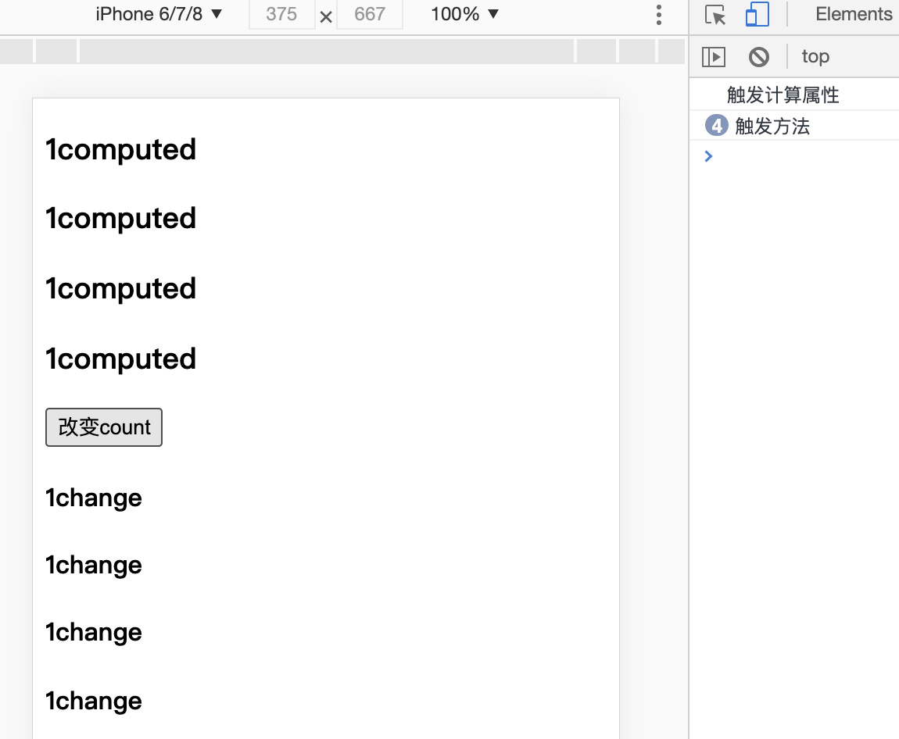

## methods方法

- 使用方式一：事件监听使用，如 `@click="changeCount"`;
- 使用方式二：直接从模板中调用方法 `computedData`，类似于后面介绍的**计算属性**

```vue
<template>
  <h2>{{computedData(count)}}</h2>
  <button @click="changeCount">改变count</button>
</template>
<script>
export default {
  name: 'App',
  data(){
    return {
      count:4
    }
  },
  methods:{
    computedData(count){
      return count+'change'
    },
    changeCount(){
      this.count++
    }
  }
}
</script>
```
:::tip 注意1
从模板调用的方法不应该有任何副作用，比如"更改数据"或"触发异步进程"。这些应该放在生命周期钩子中。
:::
因为用作"模板调用的方法"相当于计算属性，会监听数据变化再次触发该方法，这样就会导致死循环！
template模板调用的方法--->执行模板调用的方法，改变data数据--->触发模板调用的方法--->执行模板调用的方法，改变data数据--->陷入死循环

```vue
<template>
  <h2>{{computedData(count)}}</h2><!--模板调用的方法-->
</template>

<script>
export default {
  name: 'App',
  data(){
    return {
      count:4
    }
  },
  methods:{
    computedData(count){//在"模板调用的方法"更改数据,导致死循环
      this.count++
      return count+'change'
    }
  }
}
</script>
```

:::tip 注意2
Vue 自动为 methods 绑定 this，以便于它始终指向组件实例。这将确保方法在用作事件监听或回调时保持正确的 this 指向。
:::

在定义 methods 时应避免使用箭头函数，因为这会阻止 Vue 绑定恰当的 this 指向。

```js
methods:{
    changeCount:()=>{ //使用箭头函数定义，会报错
        this.count++ 
    }
}
```

## 计算属性

通过其他变量计算得到得到另外一个属性，对于任何包含响应式数据的复杂逻辑，使用计算属性。

由于和“模板调用的方法”类似，这里做对比：
使用计算属性 computedData 和方法 handleData 计算数据复杂逻辑之后的值，区别在于

- 1. 计算属性相当于逻辑处理后的data，具有响应式，以值的形式放在 template 中；而methods，需要在template中执行函数。**方法可以传参/计算属性无法传参。**
- 2. 计算属性是有缓存的，除非依赖的响应数据发生变化才会重新取值；而 methods 每次使用都会重新取值。

```vue
<template>
  <h3 v-for="(item,index) in [1,2,3,4]" :key="index">{{total}}</h3>
  <button @click="changeCount">改变count</button>
  <h4 v-for="(item,index) in [1,2,3,4]" :key="index">{{handleTotal()}}</h4>
</template>
<script>
export default {
  name: 'App',
  data(){
    return {
      count:0
    }
  },
  computed:{
    total(){
      console.log('触发计算属性');
      return this.count+'computed'
    }
  },
  methods:{
    handleTotal(count){
      console.log('触发方法');
      return this.count+'change'
    },
    changeCount(){
      this.count++
    }
  }
}
</script>
```
如下图可以看到，多次使用了computed，只会执行一次，具有缓存



再比如计算属性中有大量的计算逻辑，如多层循环，则有缓存可以大量减少重复计算问题。

```js
computed:{
    total() {
        console.log('触发计算属性');
        var vel=this.val;
        var sum=0,len=vel.length;
        for(var i=0;i<len;i++){
            sum+=vel[i]
        }
        return sum;
    }
}
```
**计算属性的setter和getter**

计算属性的set和get可以进一步的设置计算属性，此外

```vue
<template>
  <div>
      <p>fullName值: {{fullName}}</p>
      <button @click="ClickComputed">点击改变fullName的值</button>
  </div>
</template>
<script>
export default {
  data () {
    return {
      firstName: 'Foo'
    }
  },
  methods: {
    ClickComputed () {
      this.fullName = 'fullName 的新值'
    }
  },
  mounted(){
    this.fullName = 'tom lili'
  },
  computed: {
    fullName: {
      get: function () {
        return this.firstName + ':'+ this.lastName
      },
      set: function (newValue) {
        const names = newValue.split(' ')
        this.firstName = names[0]
        this.lastName = names[names.length - 1]
      }
    }
  }
}
</script>
```

## 侦听器

**1、方法一：监听变量**

>第一次绑定的时候，不会执行监听函数，只有值发生改变才会执行

```vue
<template>
  <div>
      <p>fullName值: {{fullName}}</p>
      <button @click="ClickName">点击改变fullName的值</button>
  </div>
</template>
<script>
export default {
  data () {
    return {
      fullName: 'old值'
    }
  },
  methods: {
    ClickName () {
      this.fullName = 'new新值'
    }
  },
  watch:{
    fullName(newVal,oldVal){
      console.log(newVal,oldVal)
    }
  }
}
</script>
```
**2、使用 immediate 和 handler**

>第一次绑定的时候，就会执行监听函数

immediate表示在watch中首次绑定的时候，是否执行handler，

值为true则表示在watch中声明的时候，就立即执行handler方法，

值为false，则和一般使用watch一样，在数据发生变化的时候才执行handler。

```vue
<template>
  <div>
      <p>fullName值: {{fullName}}</p>
      <button @click="ClickName">点击改变fullName的值</button>
  </div>
</template>
<script>
export default {
  data () {
    return {
      fullName: 'old值'
    }
  },
  methods: {
    ClickName () {
      this.fullName = 'new新值'
    }
  },
  watch:{
    fullName:{
      handler(newVal,oldVal){
        console.log(newVal,oldVal)
      },
      immediate:true
    }
  }
}
</script>
```

**3、深度监听deep**

当需要监听一个对象/数组的改变时，普通的watch方法无法监听到对象内部属性的改变，此时就需要deep属性对对象进行深度监听。

```vue
<template>
  <div>
      <p>{{fullName.firstName}}:{{fullName.lastName}}</p>
      <button @click="ClickName">点击改变fullName的值</button>
  </div>
</template>
<script>
export default {
  data () {
    return {
      fullName: {
        firstName:'li',
        lastName:'mei'
      }
    }
  },
  methods: {
    ClickName () {
      this.fullName.firstName = '王'
    }
  },
  watch:{
    fullName:{
      handler(newVal,oldVal){
        console.log(newVal,oldVal)
      },
      deep:true
    }
  }
}
</script>
```

如确定监听某个属性，可以按照以下形式：

```js
watch:{
    'fullName.firstName'(newVal,oldVal){
        console.log(newVal,oldVal)
    }
}
```