### SourceMap 原理解析

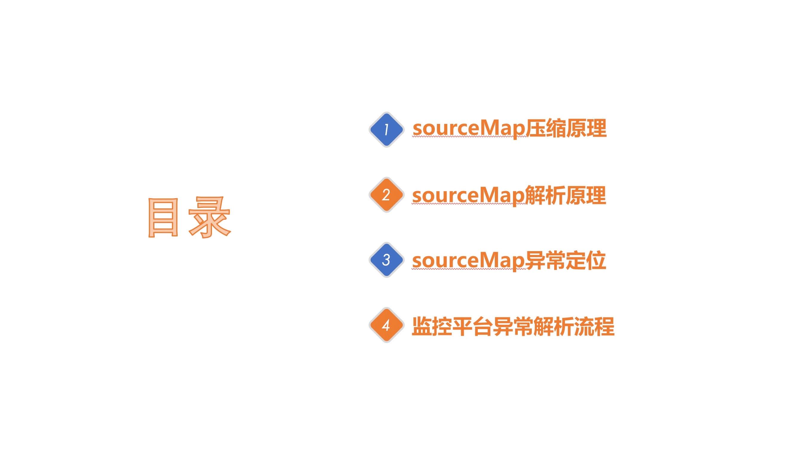
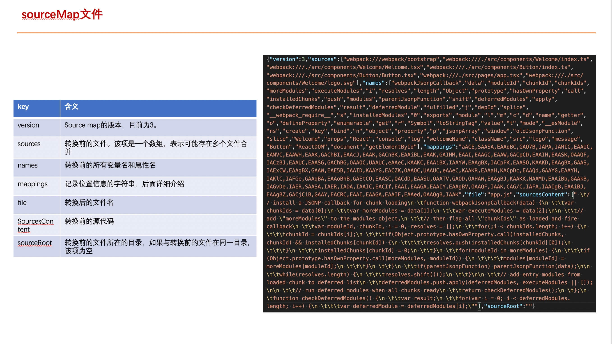
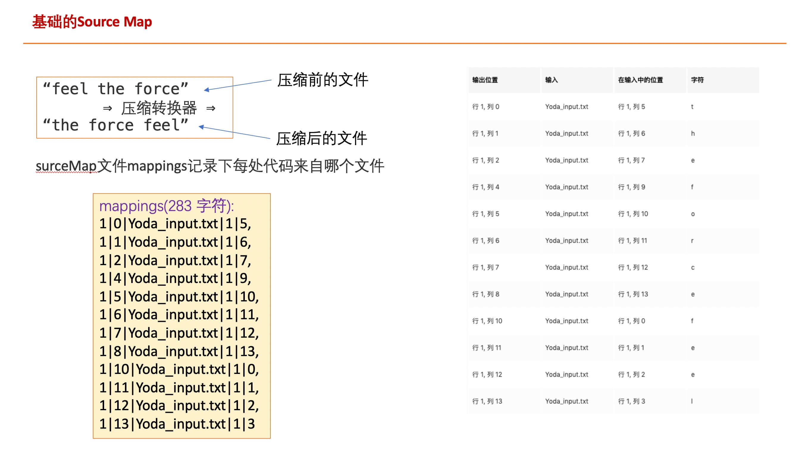
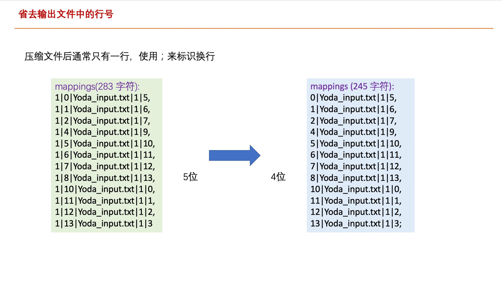
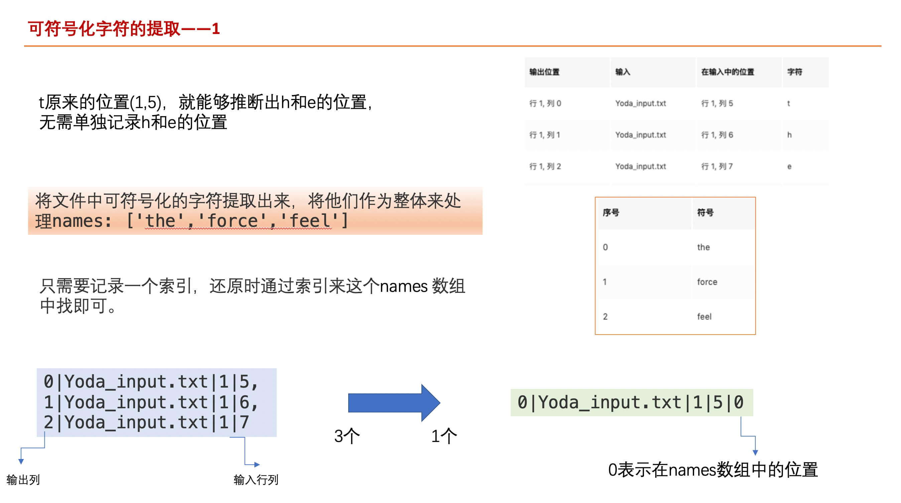
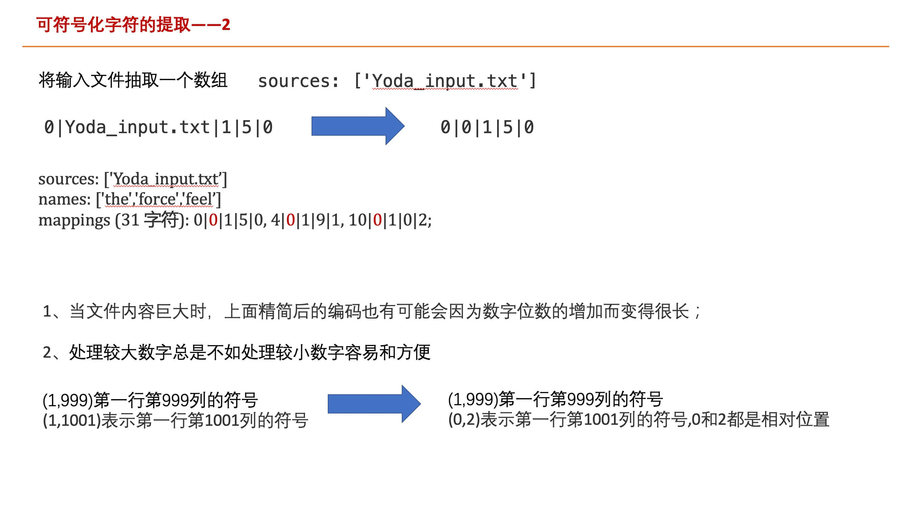
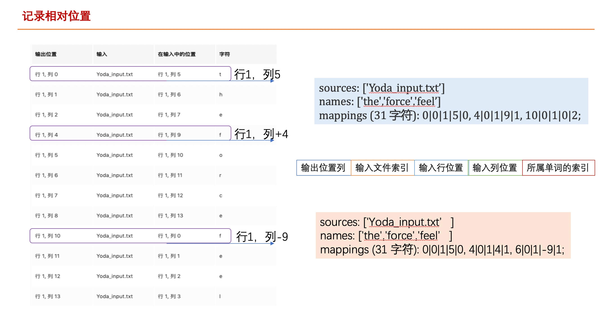
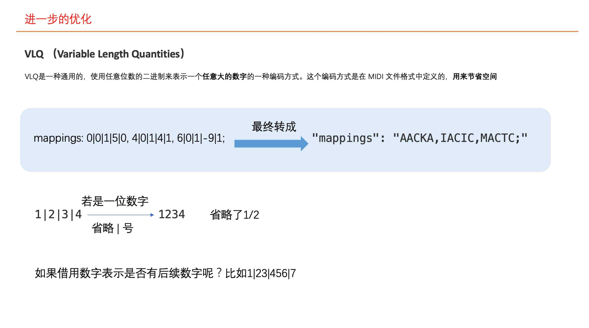
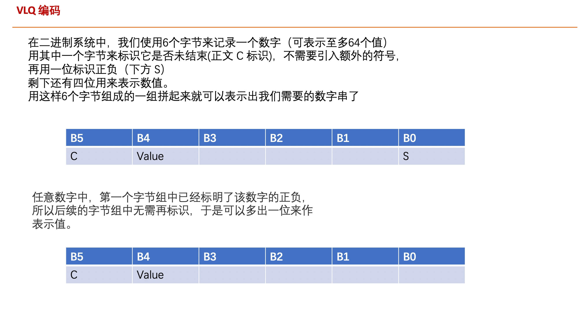
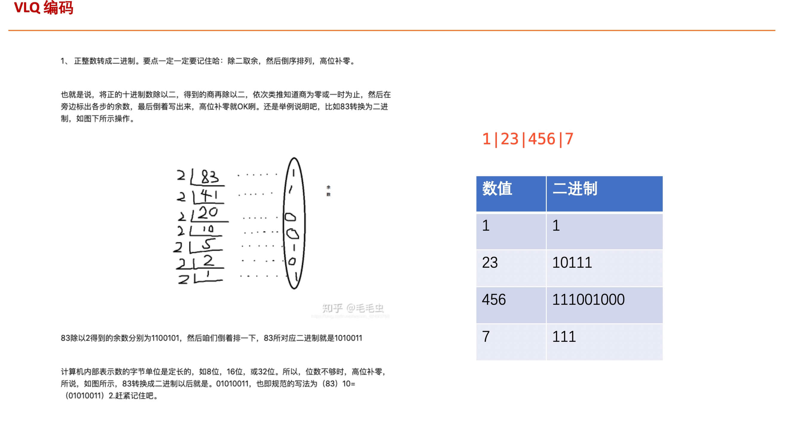
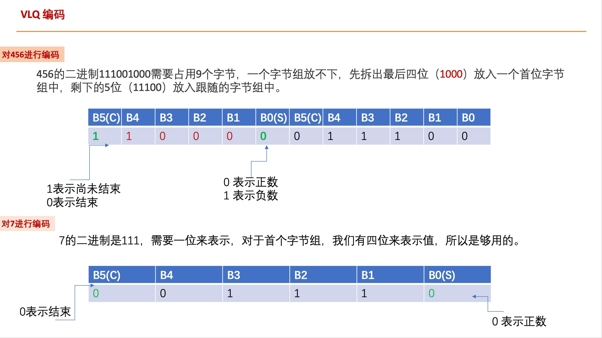
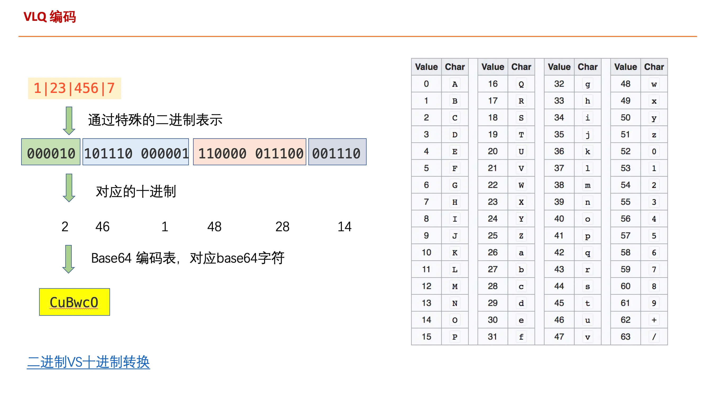
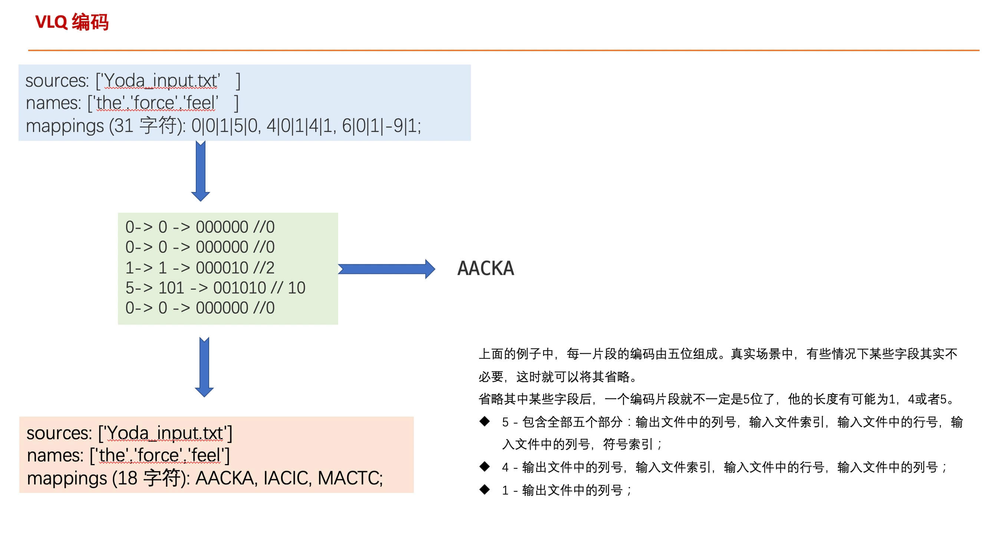
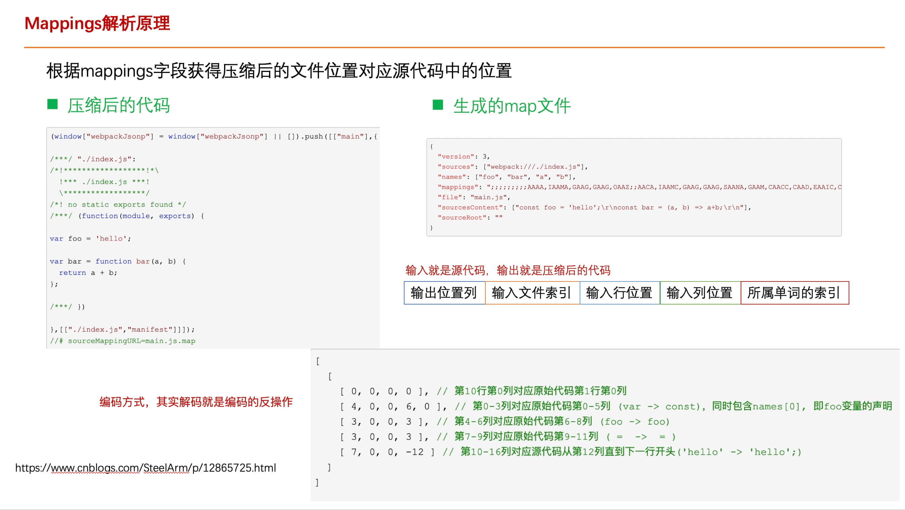

### 相关链接

- [Source Map 的原理探究](https://juejin.cn/post/6844903689610592269)
- [source-map 解析 git 库地址](https://github.com/mozilla/source-map)
- [SourceMap 解析与反解析](https://www.cnblogs.com/SteelArm/p/12865725.html)
